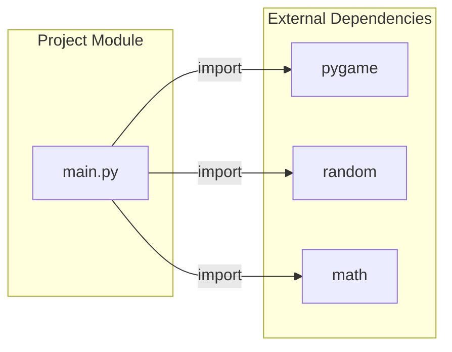
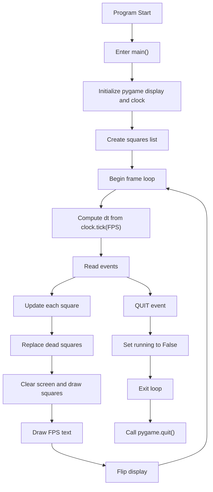
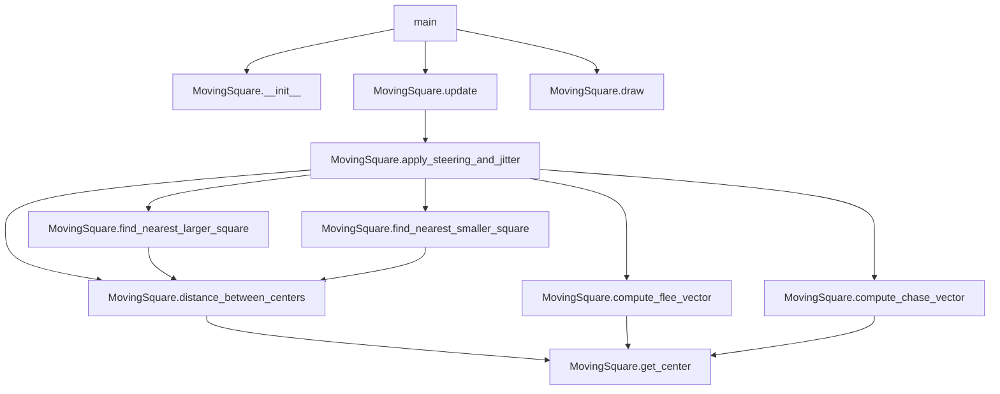
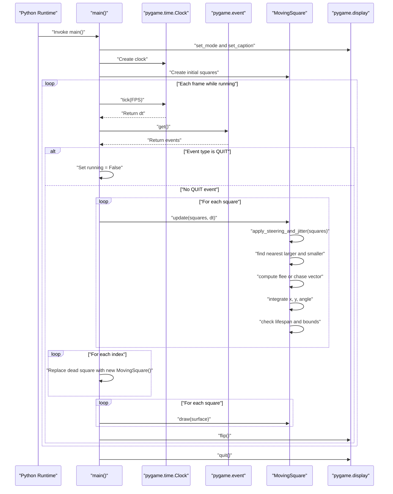

# Architecture Documentation

This document describes the runtime architecture of the `lab8-pygame` project based on the current source in `main.py`.

## Scope
- Entry point: `main()` in `main.py`
- Runtime model: one pygame loop driving a list of `MovingSquare` objects
- External libraries: `pygame`, `random`, `math`

## 1) Dependency Graph

`main.py` is the only project module and imports the three runtime dependencies used for rendering, randomization, and geometry.

## 2) High-Level Runtime Flow

The loop is frame-rate controlled by `clock.tick(FPS)` and uses `dt` for time-based motion.

## 3) Function-Level Call Graph

Square behavior is encapsulated inside class methods, while `main()` orchestrates lifecycle and rendering.

## 4) Primary Execution Sequence

This sequence captures the primary control loop, branch on `QUIT`, and nested loops for update/rebirth/draw.

## Notes and Assumptions
- The architecture is inferred strictly from `main.py`.
- No additional project modules were found under this project root.
- There is no separate service or persistence layer; all state is in-process in memory.
